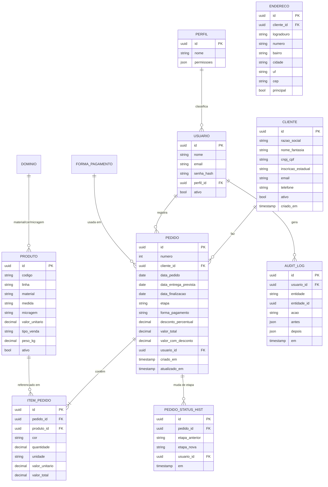

# Especificação Funcional e Técnica — Sistema de Gestão de Pedidos (EL-PACK / EXTRUSAICK POLÍMEROS)

> **Base:** engenharia reversa da planilha `Gestao_Pedidos_.xlsx`.
> **Objetivo:** servir de documento-fonte para o desenvolvimento posterior no Claude Code. **Nenhum código é gerado aqui.**
> **⚠️ Regra de dados:** a planilha contém **dados reais apenas como exemplo**. O sistema deve nascer com **banco de dados vazio**. Os dados da planilha servem **exclusivamente** para entender regras de negócio e **não devem ser importados nem replicados** no software.

---

## 0. Contexto do negócio (inferido)

- **Empresa:** EXTRUSAICK POLÍMEROS — CNPJ 40.772.936/0001-55 — Araras/SP — (19) 9.9776-4661.
- **Marca comercial:** EL-PACK ("Embalagem Tem Nome").
- **Ramo:** extrusão de filme plástico / fabricação de sacos de lixo reforçados e sacolas (polietileno / PEAD / PEBD, etc.).
- **Linhas de produto identificadas:** EL-Pack Clean, Reforçado, Super Reforçado, Mega Reforçado, Reforçado Colorido, Super Reforçado Colorido, Sacolas — variando por **capacidade (litros)**, **medida (cm)**, **micragem** e **cor**.
- **Processo atual:** controle de pedidos, produção e faturamento **inteiramente em Excel**, com abas interligadas por fórmulas e listas de validação. Um único arquivo compartilhado funciona como "sistema".

Este documento separa explicitamente, em cada seção, o que é **[REPRODUÇÃO]** do processo atual e o que é **[MELHORIA]** recomendada.

---

## 1. Engenharia reversa da planilha

A pasta de trabalho tem **7 abas**, 3 tabelas nomeadas (`tblClientes`, `tblBloquinho`, `tblProdutos`) e 4 gráficos no Dashboard.

### 1.1 Visão geral das abas

| # | Aba | Papel | Tipo |
|---|-----|-------|------|
| 1 | **Cadastro de Clientes** | Cadastro mestre de clientes | Entrada de dados |
| 2 | **Bloquinho** | Lançamento de pedidos (motor central) | Entrada + cálculo |
| 3 | **Em Produção** | Visão filtrada de pedidos em produção | Somente leitura (fórmula) |
| 4 | **Finalizados** | Visão filtrada de pedidos finalizados + análise de prazo | Semi-leitura |
| 5 | **Dashboard** | Indicadores e gráficos | Somente leitura (fórmula) |
| 6 | **Cadastro de Produtos** | Cadastro mestre de produtos/preços | Entrada de dados |
| 7 | **Tabelas Auxiliares** | Listas de referência (materiais, medidas, cores, etc.) | Configuração |

Fluxo geral: **Clientes + Produtos** alimentam o **Bloquinho** (lançamento); o Bloquinho calcula colunas auxiliares que **derivam** as abas **Em Produção**, **Finalizados** e **Dashboard**.

---

### 1.2 Aba "Cadastro de Clientes" (`tblClientes`)

**Colunas (A–L):** ID Cliente · Cliente · CNPJ · Inscrição Estadual · Endereço · Nº · Bairro · Cidade · UF · CEP · Telefone · E-mail.

**Regras e fórmulas:**
- **ID Cliente** é gerado automaticamente: `=IF(B="","",MAX($A$acima)+1)` → autonumeração sequencial começando em 1, só quando há nome de cliente.
- Coluna auxiliar de busca (**N**): `= A & " - " & B` → monta a chave **"ID - Nome"** usada nos dropdowns de pedido. Cabeçalho auxiliar: *"(busca: ID - Nome)"*.
- Sem validações de formato em CNPJ/CEP/e-mail/UF (campos livres). Observado no exemplo: CNPJs com máscaras inconsistentes, "Isento" em Inscrição Estadual, CEP às vezes ausente.

**Regras de negócio implícitas:**
- Cada cliente tem 1 endereço único (não há suporte a múltiplos endereços/contatos).
- O e-mail vira hyperlink `mailto:` automaticamente.

---

### 1.3 Aba "Cadastro de Produtos" (`tblProdutos`)

**Colunas (A–F):** ID Produto · Material · Medida · Micragem · Valor Unitário (R$) · Tipo de Venda.

**Regras e fórmulas:**
- **ID Produto** autonumerado: `=IF(B="","",MAX($A$acima)+1)`.
- **Tipo de Venda** validado por lista: **`Unidade` | `Kg`**.
- Coluna auxiliar de busca (**G**): `=TRIM(A & " - " & B & " " & C & " " & D)` → chave **"ID - Material Medida Micragem"** (ex.: *"11 - Super Reforçado 60L - 75x85cm - 10un 0,10"*), usada no dropdown de produto do pedido.
- "Medida" concentra litragem + dimensões + embalagem (ex.: *"60L - 75x85cm - 10un"*). Para itens vendidos por Kg, a medida embute o peso (ex.: *"25x35x0,03 · 2kg"*), que é **parseado** pela fórmula de preço no Bloquinho.

**Regras de negócio implícitas:**
- Preço é **por produto cadastrado** (tabela única de preço; não há tabela por cliente nem por vigência/histórico).
- Produtos vendidos por Kg têm o preço unitário dividido pelo peso extraído do texto da medida.

---

### 1.4 Aba "Bloquinho" — motor de pedidos (`tblBloquinho`, A5:S1005)

É a aba mais complexa. Linhas 1–3 = cabeçalho/branding. Área de **configuração** (coluna AA/AB): *"Nº inicial do pedido:"* = **1177** (número inicial configurável da sequência de pedidos).

**Colunas visíveis (A–S):**

| Col | Campo | Origem | Fórmula / regra |
|-----|-------|--------|-----------------|
| A | Nº Pedido | Calculado | Se há Data do Pedido → novo número (`MAX+1`, ou nº inicial configurado); senão, se há Produto, **repete o número da linha anterior**. → agrupa várias linhas de itens sob **um mesmo pedido**. |
| B | Data do Pedido | Manual | Marca o início de um novo pedido. |
| C | Data de Entrega | Calculado | `= Data do Pedido + 7` (prazo padrão de **7 dias**; editável). |
| D | Cliente | Manual (dropdown "ID - Nome") | Texto no padrão "ID - Nome". |
| E | Cidade | Calculado | `VLOOKUP(ID do cliente → Cadastro de Clientes)`. |
| F | Produto | Manual (dropdown "ID - descrição") | Chave que dispara os lookups de produto. |
| G | Material | Calculado | `INDEX/MATCH` no Cadastro de Produtos. |
| H | Medida | Calculado | idem. |
| I | Micragem | Calculado | idem. |
| J | Cor | Manual | Campo livre (referência em Tabelas Auxiliares). |
| K | Quantidade | Manual | Numérico. |
| L | Unidade | Calculado | Do "Tipo de Venda" do produto → `Kg` ou `pç`. |
| M | Valor Unit. (R$) | Calculado | Preço do produto; se vendido por Kg, `preço ÷ peso` (peso parseado do texto da medida). |
| N | Valor Total (R$) | Calculado | `= Quantidade × Valor Unit.` (total **da linha/item**). |
| O | Etapa | Manual (lista) | **`Em Produção` | `Finalizado` | `Entregue (OK)`**. |
| P | Observações | Manual | Campo livre (ex.: "Pedido Cerri 1181"). |
| Q | Forma de Pagamento | Manual (lista) | **`Dinheiro` | `Pix` | `Cartão` | `Boleto` | `Transferência`**. |
| R | Desconto (%) | Manual (lista) | **`Sem desconto` | `5%` | `10%`**. |
| S | Valor do Pedido (R$) | Calculado | `SUMIF(todas as linhas do mesmo Nº Pedido; N) × (1 − desconto)` → **total do pedido com desconto**, exibido na linha-cabeçalho do pedido. |

**Colunas auxiliares ocultas (à direita):**
- **AD** — contador sequencial de pedidos **em produção** (linhas com Data preenchida e Etapa ≠ Finalizado/Entregue). Alimenta a aba *Em Produção*.
- **AE** — contador sequencial de pedidos **finalizados** (Etapa = Finalizado). Alimenta a aba *Finalizados*.
- **AF** — chave de mês `TEXT(Data;"mm/yyyy")`. Alimenta o Dashboard.
- **AH** — ID do cliente extraído do texto "ID - Nome" (`VALUE(LEFT(...))`).
- **AI** — `MOD(Nº Pedido;4)` → usada só para faixa de cor/zebra visual por pedido.

**Regras de negócio centrais do Bloquinho:**
1. **Pedido = agrupamento de itens.** A Data do Pedido só é preenchida na 1ª linha; as linhas seguintes (só com Produto) herdam o mesmo Nº Pedido. **1 pedido → N itens (linhas)**.
2. **Numeração contínua e configurável** a partir de um número inicial (1177 no exemplo).
3. **Prazo de entrega padrão = data + 7 dias**, ajustável manualmente.
4. **Preço automático** a partir do cadastro de produto, com tratamento especial para venda por Kg.
5. **Desconto por pedido** (não por item), aplicado no total.
6. **Etapa do pedido** é o campo de status que dirige as demais visões.
7. Capacidade: até **1000 linhas** de itens (A6:S1005).

**Fragilidades observadas (chapéu de QA):**
- Cliente/Produto são **texto livre no padrão "ID - Nome/descrição"**; erro de digitação quebra os lookups silenciosamente (retornam vazio via `IFERROR`).
- Não há validação de CNPJ, e-mail, quantidade > 0, data de entrega ≥ data do pedido.
- A Etapa/Desconto/Forma de pagto ficam **na linha do item**, mas conceitualmente são **do pedido** → risco de inconsistência entre linhas do mesmo pedido.
- Limite físico de 1000 linhas.

---

### 1.5 Aba "Em Produção" (somente leitura)

- Reconstrói dinamicamente a lista de pedidos em produção via `INDEX(Bloquinho; MATCH(sequência; coluna AD))`.
- Colunas exibidas: Nº Pedido · Data do Pedido · Data de Entrega · Cliente · Etapa · Observações · Forma de Pagto · Valor do Pedido.
- Capacidade: até 200 pedidos.
- **Não é editável** — é um relatório derivado.

### 1.6 Aba "Finalizados"

- Mesmo mecanismo, via coluna **AE** (pedidos finalizados).
- Colunas A–H iguais + análise de prazo:
  - **I — Data de Finalização** (entrada **manual**).
  - **J — Situação do Prazo:** compara Data de Finalização (I) × Data de Entrega prevista (C):
    - `I < C` → **"Antecipado em X dias"**
    - `I = C` → **"No Prazo"**
    - `I > C` → **"Atrasado em X dias"**
  - **K — Dias (dif.)** = `I − C` (negativo = adiantado, positivo = atraso).

### 1.7 Aba "Dashboard" (indicadores + 4 gráficos)

**KPIs de topo:**
- **Valor Total Vendido** = `SUM(Bloquinho!N)` (soma dos totais de item, **sem** desconto).
- **Valor Total Recebido (com desconto)** = `SUM(Bloquinho!S)`.
- **Ticket Médio / Pedido** = `AVERAGEIF(S; ">0")`.

**Pedidos por Status:** `COUNTIF(Etapa = Em Produção / Finalizado / Entregue (OK))`.

**Pedidos e Faturamento por Mês (01/2026 … 12/2026):**
- Qtd por mês = `COUNTIF(AF; "mm/2026")`; coluna Acumulada.
- Faturamento por mês = `SUMIF(AF; "mm/2026"; Bloquinho!R)` + acumulado.
  > **🐞 Possível bug:** a soma de faturamento usa a coluna **R (Desconto %)** em vez de **S (Valor do Pedido)**. A ser confirmado com a empresa — no novo sistema deve usar o valor do pedido.

**Prazos de Entrega (pedidos finalizados):** Total · Antecipados · No Prazo · Atrasados · **% dentro do prazo** · **% atrasados** · **Média de dias de atraso** · **Média de dias de antecipação** (todos derivados de Finalizados!J/K).

**Gráficos:** (1) Evolução dos Pedidos (acumulado); (2) Faturamento por Mês; (3) Faturamento Acumulado; (4) Distribuição de Entregas por Prazo.

### 1.8 Aba "Tabelas Auxiliares"

Listas de referência para padronizar preenchimento:
- **Materiais** (Polietileno, PEAD, PEBD, Polipropileno, BOPP, Ráfia, Papel, Plástico, Vidro, Metal…),
- **Medidas** (30x40, 40x60, 50x80, 60x90, litragens…),
- **Micragem** (0,03 · 0,04 · 0,05 · 0,06 · 0,08 · 0,10 · 0,14…),
- **Cores** (Azul, Branco, Vermelho, Transparente, Verde, Leitoso, Amarelo, Marrom, Preto, Cinza, Colorido, Personalizado…),
- **Tipo de Resíduo** (Comum, Saúde/Hospitalar, Orgânico…).

---

## 2. Entidades de negócio

| Entidade | Descrição | Origem na planilha |
|----------|-----------|--------------------|
| **Cliente** | Empresa/pessoa compradora | Cadastro de Clientes |
| **Produto** | Item fabricado, com preço e tipo de venda | Cadastro de Produtos |
| **Pedido** | Cabeçalho (cliente, datas, status, pagamento, desconto) | Bloquinho (linha com data) |
| **Item de Pedido** | Linha de produto dentro do pedido | Bloquinho (demais linhas) |
| **Produção** | Estado/etapa e acompanhamento do pedido na fábrica | Etapa + aba Em Produção |
| **Financeiro** | Valores, forma de pagamento, desconto, faturamento | Colunas M/N/R/S + Dashboard |
| **Entrega/Prazo** | Data prevista × realizada, situação de prazo | Finalizados I/J/K |
| **Usuário** | *(não existe hoje)* operador do sistema | **[MELHORIA]** |
| **Tabelas de domínio** | Materiais, cores, micragens, medidas, tipos de resíduo, formas de pagamento, etapas | Tabelas Auxiliares + validações |
| **Log de auditoria** | *(não existe hoje)* histórico de ações | **[MELHORIA]** |

---

## 3. Modelo de dados proposto (DBA)

### 3.1 Diagrama ER (Mermaid)

### 3.2 Notas de modelagem
- **[REPRODUÇÃO]** Cliente, Produto, Pedido, Item de Pedido reproduzem o Bloquinho — mas **normalizados**: cabeçalho do pedido separado dos itens (elimina a duplicação de status/desconto por linha).
- **[MELHORIA]** `ENDERECO` como tabela separada (permite múltiplos endereços de entrega/cobrança).
- **[MELHORIA]** `numero` do pedido gerado por sequência configurável (parâmetro do sistema, equivalente ao "Nº inicial do pedido" = 1177).
- **[MELHORIA]** `valor_total`/`valor_com_desconto` persistidos no fechamento (snapshot), preservando o preço praticado mesmo que a tabela de preços mude depois — a planilha recalcula tudo em tempo real e perde histórico.
- **[MELHORIA]** Tabelas de domínio (materiais, cores, micragens, medidas, tipos de resíduo, formas de pagamento, etapas) parametrizáveis, substituindo a aba Tabelas Auxiliares e as listas fixas de validação.
- **[MELHORIA]** `PEDIDO_STATUS_HIST` e `AUDIT_LOG` inexistentes na planilha.
- **Preço por Kg:** guardar `peso_kg` estruturado em vez de parsear texto ("· 2kg").

---

## 4. Módulos e telas

Legenda: **[R]** reprodução do processo atual · **[M]** melhoria recomendada.

### 4.1 Módulo Autenticação & Acesso **[M]**
- Tela de **Login** (e-mail + senha).
- Recuperação de senha, troca de senha, logout.
- Sessão com expiração; bloqueio após N tentativas.

### 4.2 Módulo Clientes **[R]**
- Listagem com busca/filtro (nome, CNPJ, cidade) e paginação.
- Cadastro/edição com abas: Dados fiscais · Endereço(s) · Contatos.
- **[M]** Validação de CNPJ/CPF, e-mail, CEP (com autopreenchimento de endereço via CEP), UF por lista.
- **[M]** Inativar em vez de excluir (soft delete).

### 4.3 Módulo Produtos **[R]**
- Listagem/busca de produtos e preços.
- Cadastro com Linha, Material, Medida, Micragem, Cor padrão, Valor Unitário, Tipo de Venda (Unidade/Kg), Peso (para Kg).
- **[M]** Histórico de preço com vigência; ativar/inativar.

### 4.4 Módulo Pedidos **[R]** (núcleo)
- **Novo pedido:** selecionar cliente (autocomplete), adicionar N itens (produto autocomplete → material/medida/micragem/preço/unidade preenchidos automaticamente), quantidade, cor.
- Cálculo automático: total do item, total do pedido, aplicação de desconto (Sem desconto/5%/10% **[M]** ou percentual livre).
- Cabeçalho: Data do pedido, Data de entrega (default +7 dias, editável), Forma de pagamento, Desconto, Observações, Etapa.
- Listagem de pedidos com filtros por status, cliente, período, cidade.
- **[M]** Duplicar pedido; **[M]** gerar PDF/impressão do pedido; **[M]** anexos.

### 4.5 Módulo Produção **[R]**
- Painel/quadro **Kanban** por etapa (Em Produção → Finalizado → Entregue). **[M]** arraste para mudar etapa.
- Reproduz a aba "Em Produção" como filtro dinâmico.
- **[M]** Registro de data/hora de cada transição (histórico de etapas).

### 4.6 Módulo Entregas & Prazos **[R]**
- Reproduz "Finalizados": registrar Data de Finalização, calcular Situação do Prazo (Antecipado/No Prazo/Atrasado) e dias de diferença.
- **[M]** Alertas de pedidos próximos do vencimento e atrasados.

### 4.7 Módulo Financeiro **[R/M]**
- **[R]** Faturamento por mês, valor vendido, valor recebido com desconto, ticket médio.
- **[M]** Situação de pagamento (a receber/recebido), por forma de pagamento; contas a receber.

### 4.8 Módulo Dashboard **[R]** (ver §8)

### 4.9 Módulo Configurações/Administração **[M]**
- Tabelas de domínio (materiais, cores, micragens, medidas, tipos de resíduo, formas de pagamento, etapas).
- Parâmetros: nº inicial de pedido, prazo padrão de entrega (7 dias), dados da empresa (branding EL-PACK/EXTRUSAICK).
- Gestão de usuários e perfis.
- Consulta ao log de auditoria.

### 4.10 Automações **[M]**
- Numeração automática de pedido (sequência configurável) — **[R equivalente]**.
- Preenchimento automático de material/medida/micragem/preço/unidade ao escolher o produto — **[R equivalente]**.
- Data de entrega = data + prazo padrão — **[R equivalente]**.
- Recalcular status de prazo ao finalizar — **[R equivalente]**.
- **[M]** Notificações (e-mail/WhatsApp) de pedido criado, entrada em produção, atraso.
- **[M]** Geração de PDF do pedido/nota de pré-venda.

---

## 5. Login, perfis, segurança e auditoria **[M]**

### 5.1 Perfis de acesso (sugestão inicial)
| Perfil | Acesso |
|--------|--------|
| **Administrador** | Tudo, incluindo usuários, parâmetros e auditoria. |
| **Vendas/Comercial** | Clientes, produtos (leitura), pedidos (criar/editar), dashboard. |
| **Produção** | Fila de produção, mudança de etapa, sem preço/financeiro. |
| **Financeiro** | Pedidos (leitura), descontos, faturamento, relatórios. |
| **Leitura/Gerência** | Apenas dashboards e relatórios. |

Permissões modeladas como JSON por perfil (RBAC), permitindo granularidade por módulo/ação.

### 5.2 Segurança (requisitos)
- Senhas com hash forte (bcrypt/argon2); nunca em texto puro.
- Autenticação por sessão/JWT; expiração e refresh.
- Controle de acesso por perfil em cada rota/ação (backend, não só UI).
- Proteção contra SQL injection, XSS, CSRF; validação server-side.
- HTTPS obrigatório; variáveis sensíveis em ambiente, não no código.
- Backup automático do banco; política de retenção.
- **[M]** LGPD: dados de clientes (CNPJ, e-mail, telefone) — base legal, consentimento quando aplicável, direito de exclusão/anonimização.

### 5.3 Histórico de ações (auditoria)
- `AUDIT_LOG`: quem, o quê, quando, entidade, valores antes/depois.
- `PEDIDO_STATUS_HIST`: trilha específica de mudanças de etapa (com usuário e timestamp).
- Registros de auditoria **imutáveis** (append-only).

---

## 6. Requisitos

### 6.1 Requisitos funcionais (RF)
- **RF01** Cadastrar/editar/inativar clientes, com validação fiscal.
- **RF02** Cadastrar/editar/inativar produtos e preços (Unidade/Kg).
- **RF03** Criar pedido com múltiplos itens; numeração automática configurável.
- **RF04** Preencher automaticamente dados do produto e cidade do cliente.
- **RF05** Calcular total do item, total do pedido e aplicar desconto.
- **RF06** Definir e alterar a etapa do pedido (Em Produção / Finalizado / Entregue).
- **RF07** Registrar data de finalização e calcular situação de prazo e dias de diferença.
- **RF08** Exibir fila de produção filtrada por etapa.
- **RF09** Dashboard com KPIs e gráficos (§8).
- **RF10** Autenticação, perfis e permissões.
- **RF11** Registrar histórico de ações e de mudança de etapa.
- **RF12** Configurar tabelas de domínio e parâmetros do sistema.
- **RF13** Gerar impressão/PDF do pedido. **[M]**
- **RF14** Filtros e busca em todas as listagens (cliente, período, status, cidade).
- **RF15** Exportar relatórios (CSV/Excel/PDF). **[M]**

### 6.2 Requisitos não funcionais (RNF)
- **RNF01 Desempenho:** listagens paginadas; resposta < 1s em operações comuns; suportar dezenas de milhares de pedidos (sem o teto de 1000 linhas do Excel).
- **RNF02 Usabilidade:** interface web responsiva; fluxo de novo pedido rápido (poucos cliques), replicando a agilidade do "Bloquinho".
- **RNF03 Confiabilidade:** backups diários; transações atômicas no fechamento de pedido.
- **RNF04 Segurança:** conforme §5.2.
- **RNF05 Manutenibilidade:** código organizado por módulos; regras de negócio testáveis; migrations versionadas.
- **RNF06 Portabilidade:** web (desktop e mobile); banco relacional (PostgreSQL sugerido).
- **RNF07 Auditabilidade:** toda alteração relevante logada.
- **RNF08 Internacionalização/formato:** locale pt-BR (R$, datas dd/mm/aaaa, decimal com vírgula).
- **RNF09 Disponibilidade:** meta ≥ 99% em horário comercial.

---

## 7. Perguntas em aberto (para validar com a empresa)

1. **Faturamento no Dashboard** usa a coluna de **Desconto** e não a de **Valor do Pedido** — é intencional ou é um erro a corrigir no novo sistema?
2. **Desconto:** apenas 5% e 10% fixos, ou precisa de percentual/valor livre? Desconto por item ou só por pedido?
3. **Preço:** tabela única ou preço por cliente / por volume? Precisa de histórico de preços com vigência?
4. **Prazo de entrega padrão de 7 dias** vale para todos os produtos/clientes, ou varia?
5. **Etapas do pedido:** as três (Em Produção / Finalizado / Entregue) são suficientes, ou existem outras (Aguardando aprovação, Em corte, Impressão, Faturado, Cancelado)?
6. **Estoque/matéria-prima:** precisa controlar estoque de bobinas/insumos e produto acabado? (Hoje não há.)
7. **Financeiro:** precisa de contas a receber, baixa de pagamento, parcelamento, boleto/NF-e?
8. **Emissão fiscal:** integração com NF-e/NFC-e é necessária?
9. **Multiusuário simultâneo:** quantos usuários e quais perfis reais existem hoje?
10. **Múltiplos endereços/contatos** por cliente são necessários?
11. **Produtos por Kg:** como o peso é definido hoje e qual a regra exata de preço?
12. **Unidades de medida** e **cores personalizadas**: quem cadastra novos itens de domínio?
13. **Migração:** confirmado que o banco inicia **vazio** (planilha só para regras) — algum cadastro-base (produtos/tabela de preços atual) deve ser recadastrado manualmente?
14. **Relatórios/exportações** obrigatórios e periodicidade?
15. **Notificações** (e-mail/WhatsApp) são desejadas e para quais eventos?

---

## 8. Dashboard proposto (indicadores)

**[R] Reproduzir da planilha:**
- Valor Total Vendido; Valor Total Recebido (com desconto); Ticket Médio por pedido.
- Pedidos por status (Em Produção / Finalizado / Entregue).
- Pedidos e faturamento por mês (com acumulado) — **corrigindo** para usar o valor do pedido.
- Prazos: % no prazo, % atrasados, média de dias de atraso/antecipação.
- Gráficos: evolução acumulada de pedidos, faturamento mensal, faturamento acumulado, distribuição de entregas por prazo.

**[M] Novos indicadores úteis:**
- **Pedidos no prazo vs. atrasados** (medidor/percentual em destaque, incluindo pedidos **em aberto** já vencidos, não só finalizados).
- **Produção em andamento:** nº de pedidos e valor em produção; pedidos próximos do vencimento (ex.: entrega nos próximos 3 dias).
- **Faturamento** por período, por forma de pagamento, por linha de produto e por cliente (Top 10 clientes).
- **Mix de produtos** (mais vendidos por quantidade e por receita).
- **Tempo médio de produção** (data do pedido → finalização).
- Filtros globais por período/cliente/status.

---

## 9. Roadmap por fases

### Fase 0 — Descoberta & Setup (fundação)
- Validar perguntas em aberto (§7); definir stack (sugestão: PostgreSQL + backend em Node/Python + front web).
- Modelagem final do banco (§3), migrations, ambiente, CI e backup.
- Autenticação, perfis e auditoria (base transversal).

### Fase 1 — MVP "paridade com a planilha" **[R]**
- Cadastro de Clientes e Produtos (com tabelas de domínio).
- Pedidos com múltiplos itens, cálculos automáticos, numeração e prazo padrão.
- Status/etapa do pedido + aba "Em Produção" (lista).
- Finalização com situação de prazo.
- Dashboard reproduzindo os KPIs atuais (com o cálculo de faturamento corrigido).
> Entregável: substitui o Excel para o dia a dia, com banco vazio na implantação.

### Fase 2 — Produtividade & Controle **[M]**
- Kanban de produção com histórico de etapas.
- Validações fiscais, CEP, múltiplos endereços.
- Impressão/PDF de pedido; filtros e exportações; alertas de atraso.
- Dashboard ampliado (produção em andamento, no prazo × atrasado, top clientes).

### Fase 3 — Financeiro & Fiscal **[M]**
- Contas a receber, baixa de pagamento, formas/parcelas.
- Histórico de preços; relatórios financeiros.
- (Opcional) Integração NF-e.

### Fase 4 — Automação & Escala **[M]**
- Notificações (e-mail/WhatsApp).
- Controle de estoque/insumos (se validado).
- Métricas avançadas, metas, e refinamentos de UX.

---

## 10. Resumo: Reprodução × Melhoria

| Área | [R] Reproduzir | [M] Melhorar |
|------|----------------|--------------|
| Clientes | Cadastro completo | Validação fiscal, CEP, múltiplos endereços, soft delete |
| Produtos | Cadastro + preço + tipo de venda | Histórico de preço, peso estruturado |
| Pedidos | Multi-itens, cálculo, numeração, prazo +7d, desconto | Cabeçalho normalizado, PDF, duplicar, snapshot de preço |
| Produção | Lista por etapa | Kanban + histórico de transições |
| Prazos | Situação e dias de diferença | Alertas, atrasos em aberto |
| Financeiro | Faturamento, ticket médio | Contas a receber, corrigir cálculo, por forma/linha/cliente |
| Dashboard | KPIs e 4 gráficos | Indicadores novos e filtros |
| Acesso | — (inexistente) | Login, perfis, segurança |
| Auditoria | — (inexistente) | Log de ações e de etapas |
| Domínios | Tabelas Auxiliares | Parametrização via admin |

---

> **Próximo passo sugerido:** validar as perguntas do §7 com a empresa e, em seguida, usar este documento como *briefing* no Claude Code para iniciar a Fase 0/1 (modelagem + MVP). Reforço: **implantar com banco vazio**; os dados da planilha não devem ser importados.
